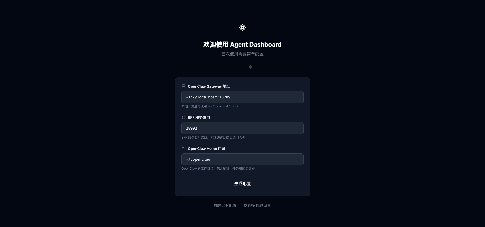
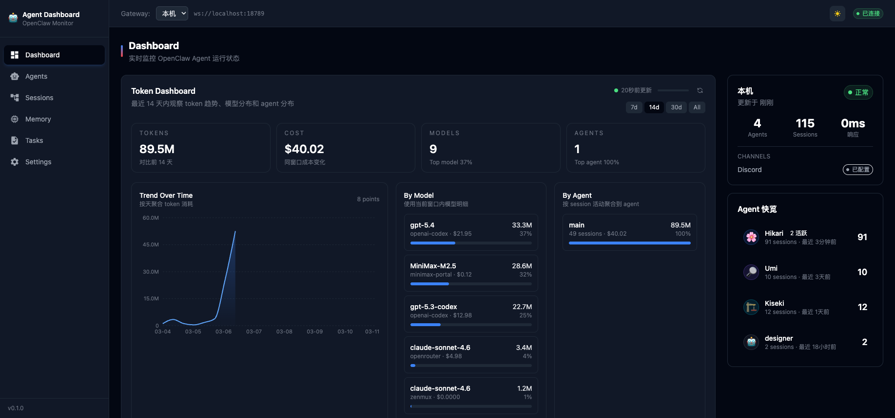
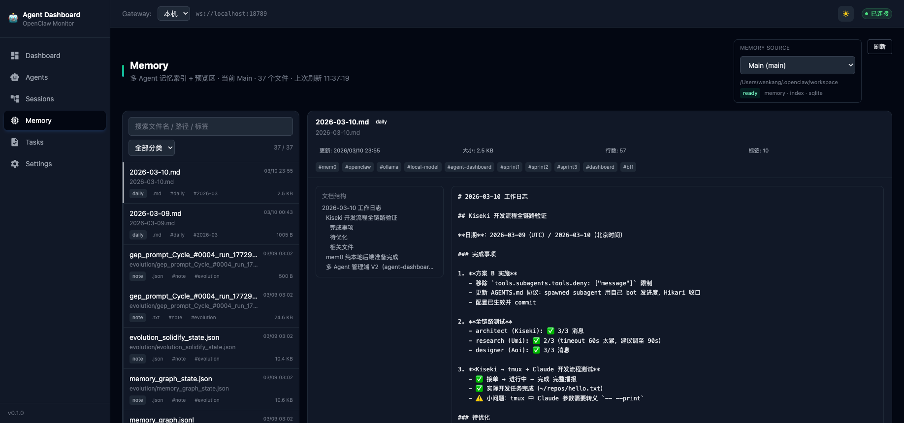
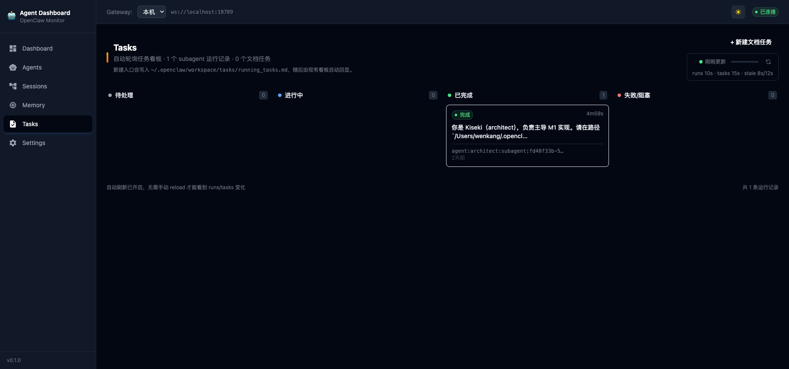

# ClawBoard

English | [简体中文](./README.zh-CN.md)

<p align="center">
  
</p>

## Screenshots

<p align="center">
  
  <br/><em>Dashboard — Token usage trends, model distribution, agent overview</em>
</p>

<p align="center">
  
  <br/><em>Memory — Multi-agent memory browser and preview</em>
</p>

<p align="center">
  
  <br/><em>Tasks — Kanban board with auto-refresh</em>
</p>

## Features

## Features

- **Dashboard** — gateway health, token trends, model/agent distribution
- **Sessions** — session list, detail view, relations, and event timeline
- **Memory** — multi-agent memory browser and preview
- **Tasks** — kanban view, auto-refresh, and task creation entry
- **Agents** — agent overview and status
- **Settings / Setup** — first-run setup flow and environment-based configuration

## Tech Stack

- Vite + React 18 + TypeScript
- Tailwind CSS
- Lightweight Node.js BFF

## Quick Start

### 1. Clone and install

```bash
git clone https://github.com/wenkang-xie/ClawBoard.git
cd ClawBoard
npm install
```

### 2. Configure environment

```bash
cp .env.example .env
```

Then edit `.env` if needed.

### 3. Start the services

```bash
# terminal 1
npm run bff

# terminal 2
npm run dev
```

- Frontend: `http://127.0.0.1:5173`
- BFF: `http://127.0.0.1:18902`

## First-Run Setup

If the project is not configured yet, ClawBoard shows a setup page that helps the user:

- enter the OpenClaw Gateway WebSocket URL
- set the BFF port
- set the OpenClaw home directory
- generate a `.env` file for local startup

## Configuration

ClawBoard uses environment variables for local adaptation.

| Variable | Default | Description |
|---|---|---|
| `BFF_PORT` | `18902` | BFF port |
| `BFF_HOST` | `127.0.0.1` | BFF bind host |
| `VITE_BFF_BASE` | `http://127.0.0.1:18902` | Frontend BFF base URL |
| `VITE_GATEWAY_WS_URL` | `ws://localhost:18789` | OpenClaw Gateway WebSocket URL |
| `OPENCLAW_HOME` | `~/.openclaw` | OpenClaw home directory |
| `TASKS_FILE` | derived | Optional custom tasks file path |
| `MEMORY_DIR` | derived | Optional custom memory directory |

> Frontend-exposed variables must use the `VITE_` prefix.

## Production Build

```bash
npm run build
npm run preview
```

Build output is written to `dist/`.

For the BFF, use a process manager such as `pm2` or `systemd`.

Example:

```bash
pm2 start "npm run bff" --name clawboard-bff
```

## Project Structure

```text
src/
  components/
  hooks/
  lib/
  pages/
  App.tsx
server/
  index.js
docs/
public/
```

## BFF API

| Method | Endpoint | Purpose |
|---|---|---|
| GET | `/api/tasks` | list document-backed tasks |
| POST | `/api/tasks` | create a new task |
| GET | `/api/runs` | list subagent runs |
| GET | `/api/sessions` | list sessions |
| GET | `/api/sessions/:key/detail` | session detail |
| GET | `/api/sessions/:key/relations` | session relations |
| GET | `/api/sessions/:key/events` | session event timeline |
| GET | `/api/v1/memory/agents` | available memory sources |
| GET | `/api/v1/memory/list?agentId=<id>` | memory file list |
| GET | `/api/v1/memory/preview?agentId=<id>&path=<p>` | file preview |
| GET | `/api/v1/memory/detail?agentId=<id>&path=<p>` | full file detail |

## Open Source Notes

- License: [MIT](./LICENSE)
- Contribution guide: [CONTRIBUTING.md](./CONTRIBUTING.md)
- Security policy: [SECURITY.md](./SECURITY.md)
- Code of conduct: [CODE_OF_CONDUCT.md](./CODE_OF_CONDUCT.md)

## Status

Current version: `v0.1.0`
