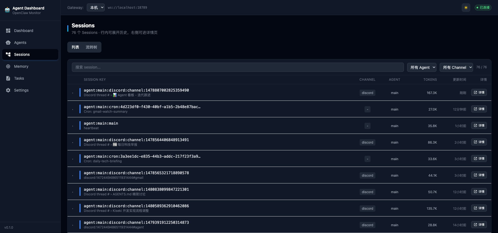

# ClawBoard

[English](./README.md) | 简体中文

<p align="center">
  
</p>

## 截图

<p align="center">
  
  <br/><em>Dashboard — Token 趋势、模型分布、Agent 概览</em>
</p>

<p align="center">
  
  <br/><em>Memory — 多 Agent 记忆浏览与预览</em>
</p>

<p align="center">
  
  <br/><em>Tasks — 看板与自动刷新</em>
</p>

<p align="center">
  
  <br/><em>Sessions — Session 列表、详情、relations</em>
</p>

## 功能

- **Dashboard**：查看 gateway 健康状态、token 趋势、模型/agent 分布
- **Sessions**：查看 session 列表、详情、relations 与事件流
- **Memory**：多 Agent memory 索引与预览
- **Tasks**：任务看板、自动刷新、新建任务入口
- **Agents**：Agent 状态与概览
- **Settings / Setup**：首次配置引导与环境变量配置

## 快速开始

### 1. 克隆并安装依赖

```bash
git clone https://github.com/wenkang-xie/ClawBoard.git
cd ClawBoard
npm install
```

### 2. 复制配置

```bash
cp .env.example .env
```

然后按需修改 `.env`。

### 3. 启动服务

```bash
# 终端 1
npm run bff

# 终端 2
npm run dev
```

- 前端：`http://127.0.0.1:5173`
- BFF：`http://127.0.0.1:18902`

## 首次引导

如果项目尚未配置，ClawBoard 会展示 Setup 页面，引导用户：

- 填写 OpenClaw Gateway WebSocket 地址
- 设置 BFF 端口
- 设置 OpenClaw home 目录
- 生成 `.env` 文件用于本地启动

## 配置项

| 变量 | 默认值 | 说明 |
|---|---|---|
| `BFF_PORT` | `18902` | BFF 端口 |
| `BFF_HOST` | `127.0.0.1` | BFF 监听地址 |
| `VITE_BFF_BASE` | `http://127.0.0.1:18902` | 前端访问 BFF 的地址 |
| `VITE_GATEWAY_WS_URL` | `ws://localhost:18789` | OpenClaw Gateway WebSocket 地址 |
| `OPENCLAW_HOME` | `~/.openclaw` | OpenClaw 根目录 |
| `TASKS_FILE` | 自动推导 | 可选的任务文件路径 |
| `MEMORY_DIR` | 自动推导 | 可选的 memory 目录 |

> 前端暴露的环境变量必须使用 `VITE_` 前缀。

## 开源协作

- 协议：[MIT](./LICENSE)
- 贡献指南：[CONTRIBUTING.md](./CONTRIBUTING.md)
- 安全策略：[SECURITY.md](./SECURITY.md)
- 社区行为规范：[CODE_OF_CONDUCT.md](./CODE_OF_CONDUCT.md)
